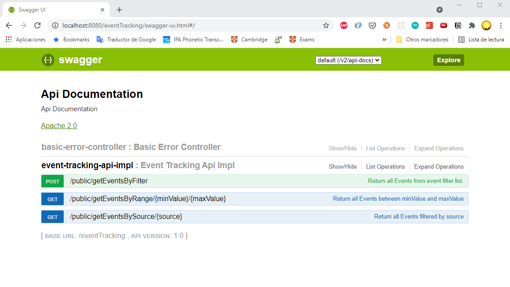

# springboot-rest-h2-swagger

El proyecto consiste en implementar una API para trabajar con esos eventos. Para ello puedes asumir las siguientes estructuras:

Fuente (id, nombre)

Evento (id, fuente_id, timestamp, valor)

La API que hay que implementar es:

- Buscar eventos por lista de timestamps.

- Buscar eventos por fuente_id.

- Buscar eventos dentro de un rango de valores (valor min, valor max).

# Fichero con datos (H2)
data.sql

# Ejecutar aplicación SpringBoot
Ejecutar clase EventTrackingApplication.java

# Urls

**Swagger url:** (http://localhost:8080/eventTracking/swagger-ui.html)

